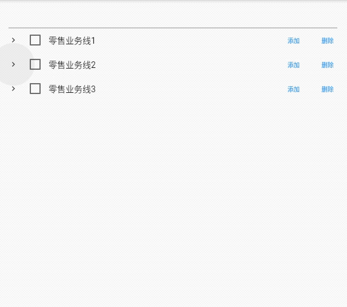
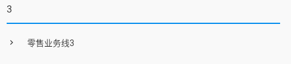
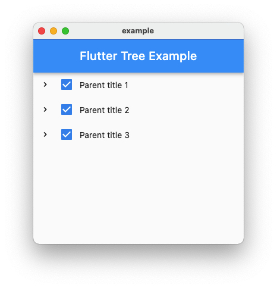
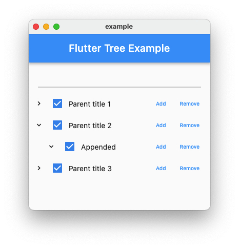
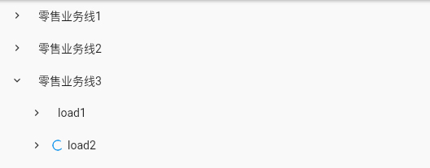

# Flutter Tree

[](https://github.com/xrr2016/flutter_tree/stargazers) [](https://pub.dev/packages/flutter_tree) [](https://github.com/xrr2016/flutter-tree/actions/workflows/main.yml)


[Version1](./readme.v1.md)

[Online Example](http://fluttertree.coldstone.fun)

## Install

```yml
dependencies:
  flutter_tree: ^2.0.0
```

## Uasge



### First Step

```dart
/// Your server data
final serverData = [
  {
    "checked": true,
    "children": [
      {
        "checked": true,
        "show": false,
        "children": [],
        "id": 11,
        "pid": 1,
        "text": "零售业务线11",
      },
    ],
    "id": 1,
    "pid": 0,
    "show": false,
    "text": "零售业务线1",
  },
  {
    "checked": true,
    "show": false,
    "children": [],
    "id": 2,
    "pid": 0,
    "text": "零售业务线2",
  },
  {
    "checked": true,
    "children": [],
    "id": 3,
    "pid": 0,
    "show": false,
    "text": "零售业务线3",
  },
];

/// Map server data to tree node data
TreeNodeData mapServerDataToTreeData(Map data) {
  return TreeNodeData(
    extra: data,
    title: data['text'],
    expaned: data['show'],
    checked: data['checked'],
    children:
        List.from(data['children'].map((x) => mapServerDataToTreeData(x))),
  );
}

/// Generate tree data
List<TreeNodeData> treeData = List.generate(
  serverData.length,
  (index) => mapServerDataToTreeData(serverData[index]),
);
```

### Basic

```dart
TreeView(data: treeData)
```


### Show Filter

```dart
TreeView(
  data: treeData,
  showFilter: true,
),
```



### Checked

```dart
TreeView(
  data: treeData,
  showCheckBox: true,
),
```



### Show Actions

```dart
/// Make sure pass `append` function.

TreeView(
  data: treeData,
  showActions: true,
  showCheckBox: true,
  append: (parent) {
    print(parent.extra);
    return TreeNodeData(
      title: 'Appended',
      expaned: true,
      checked: true,
      children: [],
    );
  },
),
```



### Bind Events

```dart
TreeView(
  data: treeData,
  showActions: true,
  showCheckBox: true,
  append: (parent) {
    return TreeNodeData(
      title: 'Appended',
      expaned: true,
      checked: true,
      children: [],
    );
  },
  onTap: (node) {
    print(node.extra);
  },
  onCheck: (checked, node) {
    print(checked);
    print(node.extra);
  },
  onCollapse: (node) {
    print(node.extra);
  },
  onExpand: (node) {
    print(node.extra);
  },
  onAppend: (node, parent) {
    print(node.extra);
    print(parent.extra);
  },
  onRemove: (node, parent) {
    print(node.extra);
    print(parent.extra);
  },
),
```

### Lazy load

```dart
/// Create your load function, return list of TreeNodeData

Future<List<TreeNodeData>> _load(TreeNodeData parent) async {
  await Future.delayed(const Duration(seconds: 1));
  final data = [
    TreeNodeData(
      title: 'load1',
      expaned: false,
      checked: true,
      children: [],
      extra: null,
    ),
    TreeNodeData(
      title: 'load2',
      expaned: false,
      checked: false,
      children: [],
      extra: null,
    ),
  ];

  return data;
}

TreeView(
  data: treeData,
  lazy: true,
  load: _load,
  onLoad: (node) {
    print('onLoad');
    print(node.extra);
  },
),

```



## All Props

| property     |                        type                         |       default       |        description        | required |
| :----------- | :-------------------------------------------------: | :-----------------: | :-----------------------: | :------: |
| data         |                `List<TreeNodeData>`                 |        `[]`         |         Tree data         |  `true`  |
| lazy         |                       `bool`                        |       `false`       |    Lazy load node data    | `false`  |
| icon         |                      `Widget`                       | `Icons.expand_more` |         Tree icon         | `false`  |
| offsetLeft   |                      `double`                       |       `24.0`        |     Item padding left     | `false`  |
| showFilter   |                       `bool`                        |       `false`       |     Show tree filter      | `false`  |
| showActions  |                       `bool`                        |       `false`       |     Show node actions     | `false`  |
| showCheckBox |                       `bool`                        |       `false`       |    Show node checkbox     | `false`  |
| onTap        |              `Function(TreeNodeData)`               |       `null`        |     Node tap callback     | `false`  |
| onExpand     |              `Function(TreeNodeData)`               |       `null`        |   Node expaned callback   | `false`  |
| onLoad       |              `Function(TreeNodeData)`               |       `null`        |  Node lazy load callback  | `false`  |
| onCollapse   |              `Function(TreeNodeData)`               |       `null`        |  Node collapse callback   | `false`  |
| onCheck      |           `Function(bool, TreeNodeData)`            |       `null`        |    Node check callback    | `false`  |
| onAppend     |       `Function(TreeNodeData, TreeNodeData)`        |       `null`        |   Node append callback    | `false`  |
| onRemove     |       `Function(TreeNodeData, TreeNodeData)`        |       `null`        |   Node remove callback    | `false`  |
| append       |              `Function(TreeNodeData)`               |       `null`        | Append node data function | `false`  |
| load         | `Future<List<TreeNodeData>> Function(TreeNodeData)` |       `null`        |  Load node data function  | `false`  |

## Contribute

1. Fork it (https://github.com/xrr2016/flutter_tree.git)
2. Create your feature branch (git checkout -b feature/foo)
3. Commit your changes (git commit -am 'Add some foo')
4. Push to the branch (git push origin feature/foo)
5. Create a new Pull Request

## License

[MIT](./LICENSE)

