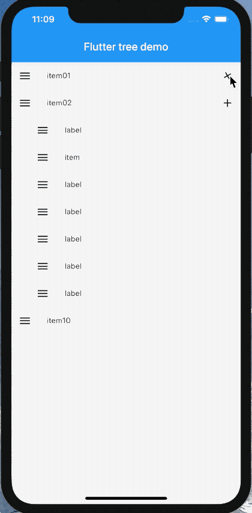
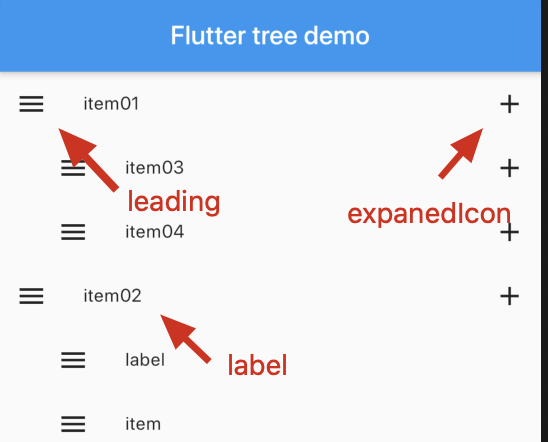

# flutter_tree

[](https://github.com/xrr2016/flutter_tree/stargazers) [](https://pub.dev/packages/flutter_tree) 

Flutter tree widget

## Example



## Install

```yml
dependencies:
  flutter_tree: ^0.1.0
```

## Uasge

```dart
final List<Map<String, dynamic>> data = [
  {
    "label": "level01",
    "expaned": true,
    "children": [
       {
        "label": "level02",
        "expaned": true,
        "children": []
      }
    ]
  }
]

TreeView(data: data),
```

## Config



### TreeView

| property | type | default | description | required |
| :- | :---: | :---: | :---: | :-: |
| data | List<Map<String, dynamic>> |  | tree data | true |
| labelKey | String | `label` | Key to render label text | false |
| expanedKey | String | `expaned` | Key that determine whether the tree expands  | false|
| childrenKey | String | `children` | The key of the subtree data | false |
| leading | Widget | `IconButton()` | leading widget | false |
| expanedIcon | Icon | `Icon(Icons.expand_more)` | right icon | false |
| offsetLeft | double | `24.0` | Child tree offset left | false |
| leadingOnTap | Function | `null` | Callback when tap on leading | false |
| labelOnTap | Function | `null` | Callback when tap on label | false |


## Contribute

1. Fork it (https://github.com/xrr2016/flutter_tree.git)
2. Create your feature branch (git checkout -b feature/foo)
3. Commit your changes (git commit -am 'Add some foo')
4. Push to the branch (git push origin feature/foo)
5. Create a new Pull Request

## License

[MIT](./LICENSE)

